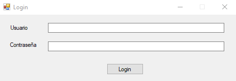
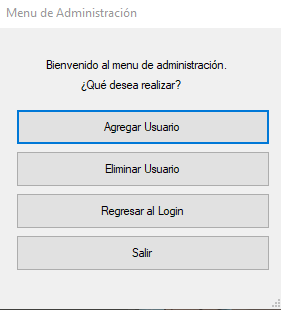
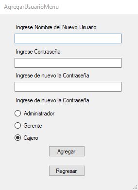
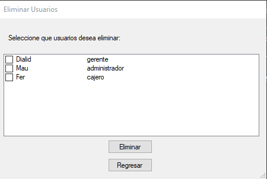
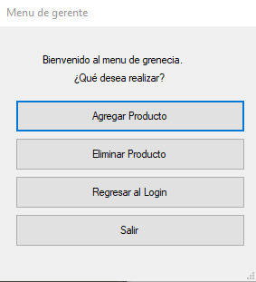
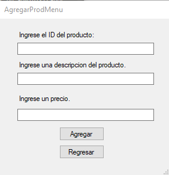
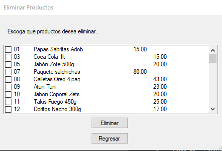

# Proyecto Final del Curso de Programación Orientada a Objetos del programa de Becarios-CERT

## Proyecto realizado por:
## Ceron Rodriguez Lesly Dialid
## Luis Fernando Resendiz Cruz
## Urbina Garrido Mauricio

## Login

En esta pantalla se debe ingresar el usuario y contraseña para acceder a la sección de trabajo de acuerdo al perfil.

Nuestro proyecto cuenta con tres secciones distintas: 

Administración: Administra usuarios creandolos y eliminandolos.

Gerenecial: Administra los productos que se venden agregando y eliminando produtos.

Cajero: Se realiza las compras.

## Administración

Para acceder a esta seccion es necesario acceder con el nombre de usuario: Mau y contraseña: 12345 desde el login

En esta seccion podemos acceder a las secciones de agregar usuarios, eliminar usuarios, regresar al login o salir del programa.

### Agregar usuario

Para agregar usuarios se solcita el nombre del usuario, contraseña, confimacion de la contraseña y puesto que desempeñara.

### Eliminar usuario

En esta seccion se muestra la lista de usuarios actuales, para eliminar se puede seleccionar distintos usuarios pero no se permite eliminar todos se debe de mantener al menos un administrador para funcionar.

## Gerencial

Para acceder a esta seccion es necesario acceder con el nombre de usuario: Dialid y contraseña: hola123., desde el login

En esta seccion podemos acceder a la acceder a las secciones de agregar productos, eliminar productos, regresar al login o salir del programa.

### Agregar productos

Para agregar usuarios se solcita el ID del producto que no debera ser nulo ni se debera repetir, una descripción que no se debera repetir ni ser nulo y precio que debera ser un flotante Ej. 12.00 ó 12.99

### Eliminar productos

En esta seccion se muestra la lista de productos permitiendo seleccionar que productos se pueden eliminar, la unica restriccion es que debe de existir un solo producto.

## Cajero

Para acceder a esta seccion es necesario acceder con el nombre de usuario: Fer y contraseña: qwerty desde el login

## General

El programa genera una carpeta llamada "BecarioMart" donde es contenido los usuarios, productos y historila de tickets y el ticket de la ultima compra.